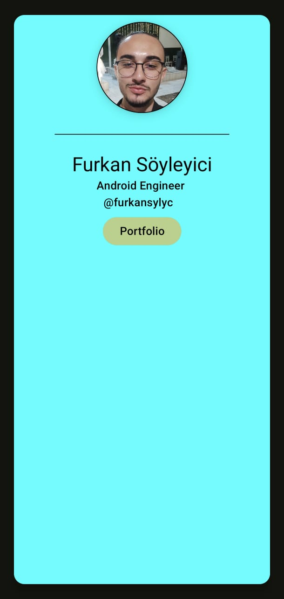
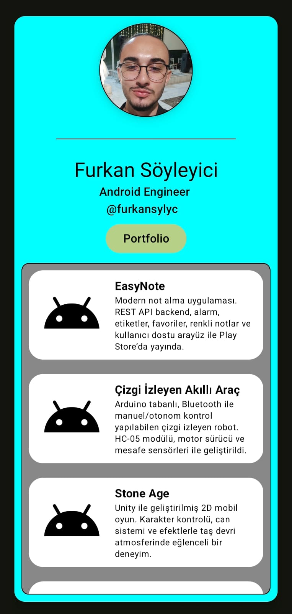
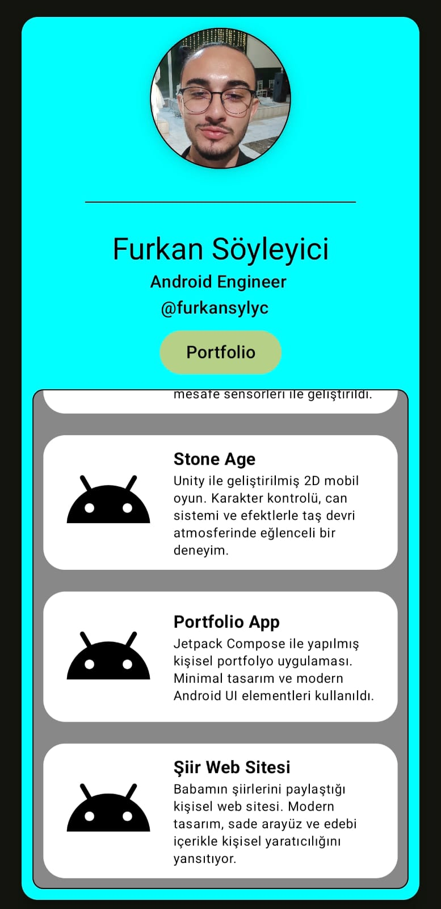

# Portfolio App

This project is a personal portfolio application developed with Jetpack Compose. It presents the developer's personal information, profile picture, and completed projects with a modern user interface.

## ✨ Key Features

*   **Personal Information: Displays basic information such as the user's name, title, and social media details.
*   **Profile Picture: Shows the profile picture with a circular and bordered design.
*   **Project List: Lists the developer's projects along with their names and short descriptions.
*   **Interactive Project Section: The visibility of the project list can be toggled via a button.
*   **Modern UI: A user interface fully created with Jetpack Compose, following Material Design principles.

## 🛠️ Technologies Used

*   **Kotlin:** Main programming language.
*   **Jetpack Compose:** UI development kit.
*   **Material 3:** Material Design components for Compose.

## Screenshots

  
  
  

